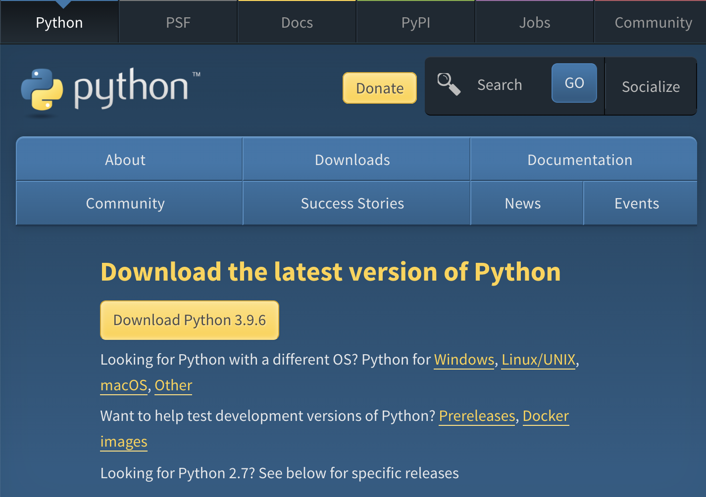
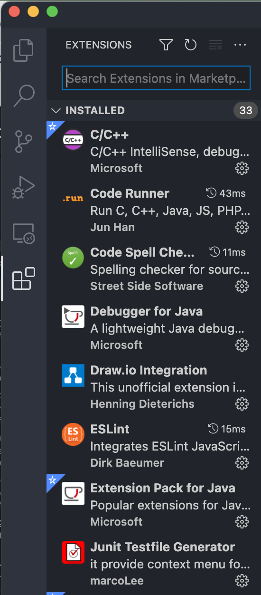
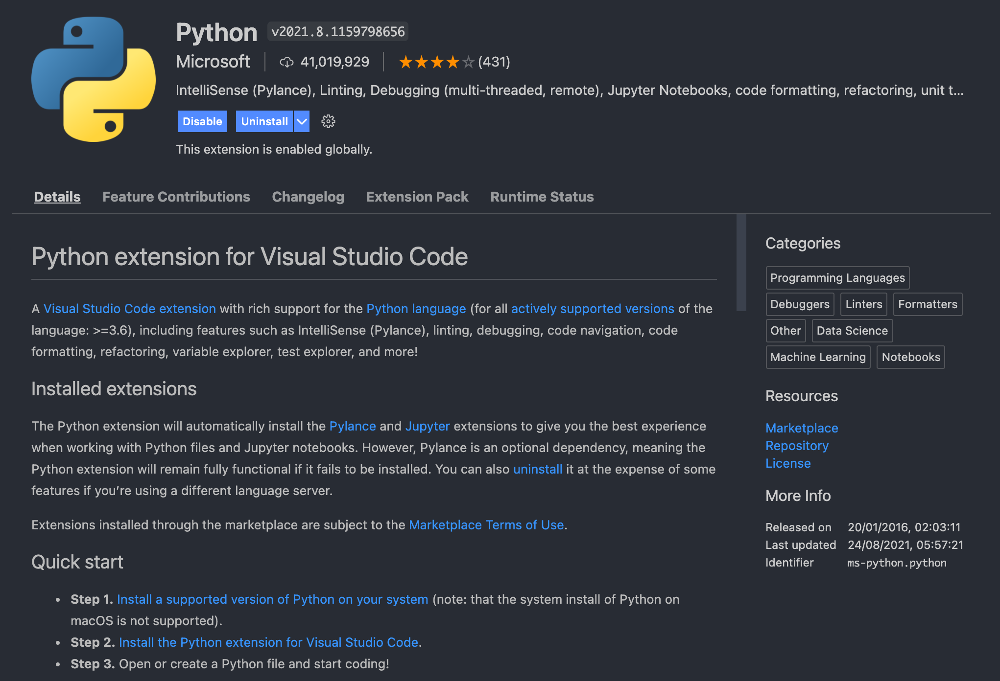
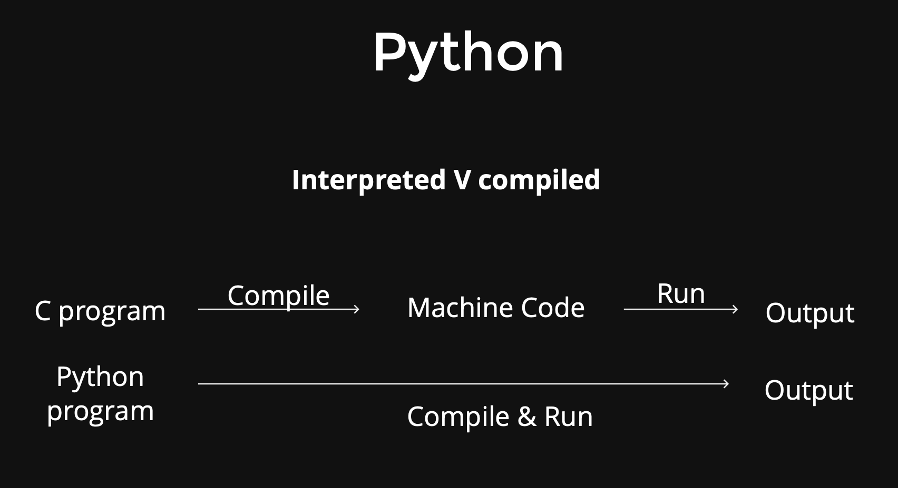

## Tutorial 1 🐰

### 1.1 Environment Setup

#### Terminal and Shell

[What is the difference between Terminal, Console, Shell, and Command Line?](https://askubuntu.com/questions/506510/what-is-the-difference-between-terminal-console-shell-and-command-line)

In this tutorial, the macOS terminal application is recommended to run the Python program instead of the Python IDLE.

#### Installing Python

[Installing Python 3 on Mac OS X](https://docs.python-guide.org/starting/install3/osx/)

Firstly, Python is an *interpreted programming language* that the script could not be executed without an interpreter. Manually installing the correct version is **necessary** for any beginner.

`Python 2.*` is pre-installed on the macOS, and it works as an essential part of the operating system that the user **should not** removes or modifies any system-level files. Otherwise, some unknown errors might be caused. The user **should** install `Python 3.*` separately and set paths.

The newest version is `Python 3.9.6`, and it could be downloaded and installed from <https://www.python.org/downloads/>. There are huge differences between `Python 2` and `Python 3`, and dependencies are not sharable.



Check your Python version by input the following commands in the shell:

```
python --version
python3 --version
```

#### Packages Installing by `pip`

After installing the Python interpreter, a package manager called `pip` is also installed in your environment. You could check the `pip` version and its linked interpreter by writing:

```
pip3 --version
```

If you want to call a method from an external module or package in your program, you must install it and import it; we would discuss the module and package later. However, if the lack of modules returns any warning, you need to install it first.

Upgrade the `pip` package manager:

```
pip3 install --upgrade pip
```

#### Installing Jupyter Notebook

Jupyter Notebook is widely used in data science because of its easy-to-read properties.

> Jupyter Book is an open-source project for building books and documents from computational material.[20] It allows the user to construct the content in a mixture of Markdown, an extended version of Markdown called MyST,[21] Maths & Equations using MathJax, Jupyter Notebooks, reStructuredText, the output of running Jupyter Notebooks at build time. Multiple output formats can be produced (currently single files, multipage HTML web pages and PDF files).


Installation with `pip`:

```
pip3 install jupyter
```

Jupyter Notebook is based on the Web, so start with the following command would open a new tab from your browser:

```
jupyter notebook
```

Because Jupyter Notebook occupies the port, the user could not execute any command from the same terminal until logging out of the notebook. You **should** open a new tab in the terminal and do not close the previous window.

#### Installing VS Code and Its Python Extensions

> Visual Studio Code is an integrated development environment made by Microsoft for Windows, Linux and macOS.[9] Features include support for debugging, syntax highlighting, intelligent code completion, snippets, code refactoring, and embedded Git. Users can change the theme, keyboard shortcuts, preferences, and install extensions that add additional functionality.

> In the Stack Overflow 2021 Developer Survey, Visual Studio Code was ranked the most popular developer environment tool, with 70% of 82,000 respondents reporting that they use it.[11]

Downloading the **Stable Build** via <https://code.visualstudio.com/>, and then installing extensions by inner Marketplace.



Installing the official Python extension is highly recommanded.



### 1.2 Command Line

[Tiger's Note: Unix-like OS Commands](https://github.com/flying-yogurt/Lux/blob/master/%23%20Computer%20Science/Others/Unix-like%20OS%20Commands.md)

[Linux Command Cheat Sheet](https://www.guru99.com/linux-commands-cheat-sheet.html)

### 1.3 Introduction to Python

> Python is an **interpreted** high-level general-purpose programming language. Its design philosophy emphasizes code readability with its use of significant **indentation**. Its language constructs as well as its object-oriented approach aim to help programmers write clear, logical code for small and large-scale projects.[30]

> Python is **dynamically-typed** and **garbage-collected**. It supports multiple programming paradigms, including structured (particularly, procedural), object-oriented and functional programming. It is often described as a "batteries included" language due to its comprehensive standard library.[31]

#### Why Python?

- Close to human language leads the good readability
- Easy to learn and use
- Huge amounts of supported modules
- Widely using in variates aspects

#### Differences between `C` and `Python`



### 1.4 Git

> Git is a software for tracking changes in any set of files, usually used for coordinating work among programmers collaboratively developing source code during software development. Its goals include speed, data integrity, and support for distributed, non-linear workflows (thousands of parallel branches running on different systems).[8][9][10]

> Git was created by Linus Torvalds in 2005 for development of the Linux kernel, with other kernel developers contributing to its initial development.[11] Since 2005, Junio Hamano has been the core maintainer. As with most other distributed version control systems, and unlike most client–server systems, every Git directory on every computer is a full-fledged repository with complete history and full version-tracking abilities, independent of network access or a central server.[12] Git is free and open-source software distributed under GNU General Public License Version 2.


You could use this cheat sheet to get familiar with git usage. <https://education.github.com/git-cheat-sheet-education.pdf>

### 1.5 Practices

1. [Lab 01: Git Using](https://github.com/flying-yogurt/Lux/blob/master/%23%20Computer%20Science/Rabbit's%20Python%20Tutorials%20(Data%20Aspect)/Labs/lab01.md)
2. [Lab 02: Environment Setup](https://github.com/flying-yogurt/Lux/blob/master/%23%20Computer%20Science/Rabbit's%20Python%20Tutorials%20(Data%20Aspect)/Labs/lab02.md)
