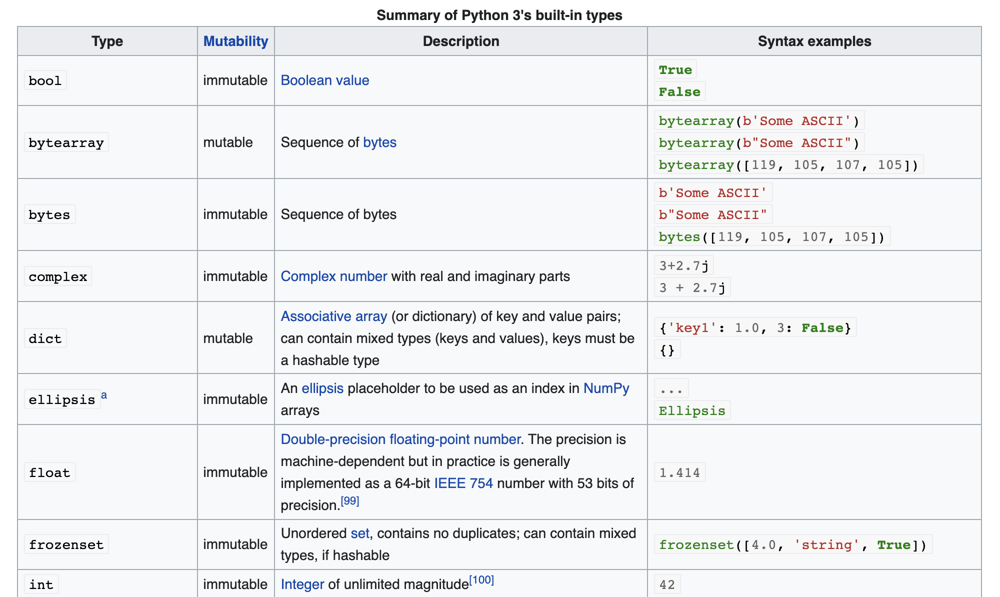
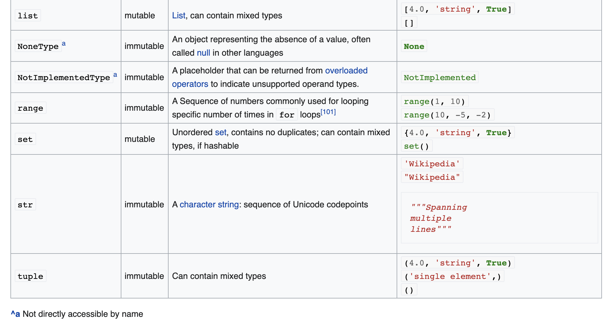
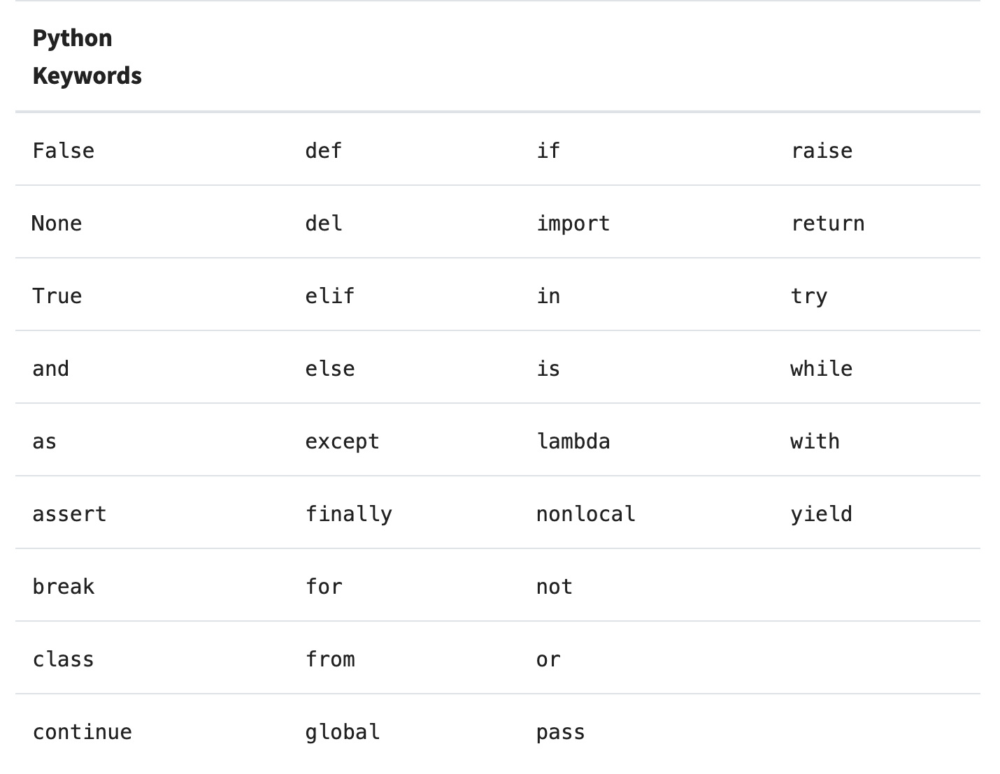

# Tutorial 2 🐰

## 2.1 Basic Python

### Comments

Python would not execute any commented sentence, and it is also a good habit to write down more comments that make your code readable and easy to understand, not only for others you working with but also yourself.

In Python, and text start with a hash(#) is an in-line comment. For example:

```python
print("Hello World!")
# This is a comment.
print("Hello World again!") # This is also a comment.
```

The triple quote can also be used as a comment if it is **not assigned** to a variable. For example:

```python
"""Multiline Comments:
All contents between two triple quotes would be comments,
if and only if it is not assigned to a variable.
Otherwise, it would be a string variable.
"""
```

### Variables

```
┌──────────┐   ┌────┬──────┬──────┐
│ Variable │ = │ ID │ Type │ Data │
└──────────┘   └────┴──────┴──────┘
```

**Variable Names:**
  - Can only contains alpha-numeric characters and underscores
  - Cannot start with a numeric character
  - Cannot conflict with reserved words ([keywords](#keywords) in Python)
  - Case sensitive

You could change the string `variable_name` to the name you wanted and run the Python function `isValidVariableName()` to test these rules.

It would be suggested to declare a variable by the following rule:
  - Use lowercase characters and combine words with underscores
  - Protected instance start with a single underscore
  - Private instance start with two underscores

### Indentation

It might be different from other languages. In `C` or `Java`, the indentation is only used to improve the code readability; but in Python, it uses indentation to control the code blocks. So the wrong indentation would be so common to cause a bug, especially for beginners.

### Basic data Types

- `int`: Integer. It could be the binary (base-2), octal (base-8), decimal (base-10) and hexadecimal (base-16) bases. For example:

  ```python
  int_a = 0b1000
  int_b = 0o700
  int_c = 999
  int_d = 0xFFFF
  ```

  *The `print()` function used decimal output as the default format.*

- `float`: Double-precision floating-point number.

   ```python
   float_a = 2444.763
   float_b = 2.444763e3
   ```

- `complex`: Complex number. It could be written as `2 + 4.2j`.

- `string`: A character string: sequence of Unicode codepoints.

  ```python
  string_a = 'this'
  string_b = "is a string"
  ```

- `bool`: Boolean type, only two values, `True` and `False`.




***Some inner methods are provided to covert data types.***


### Keywords



### Operations

- addition(+)
- subtraction(-)
- multiplication(*)
- modulus(%)
- division(/)
- exponential(**)
- floor division operator(//)