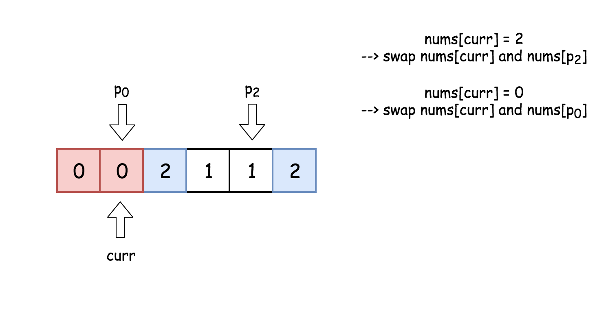
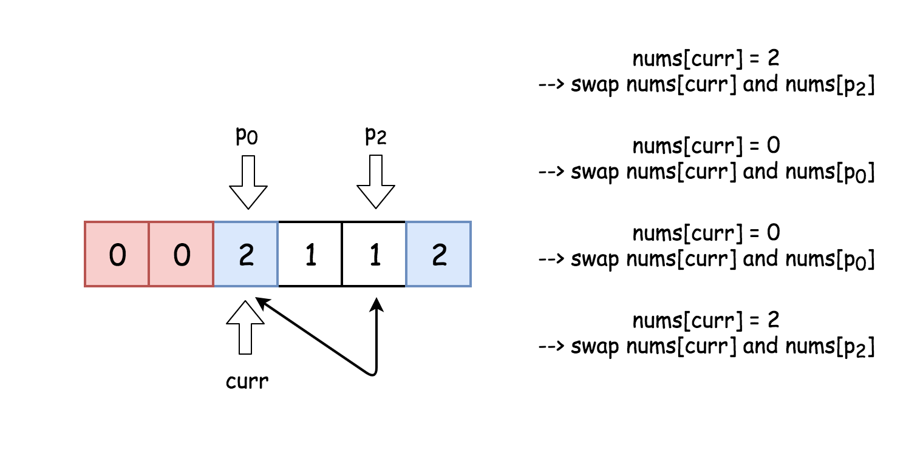
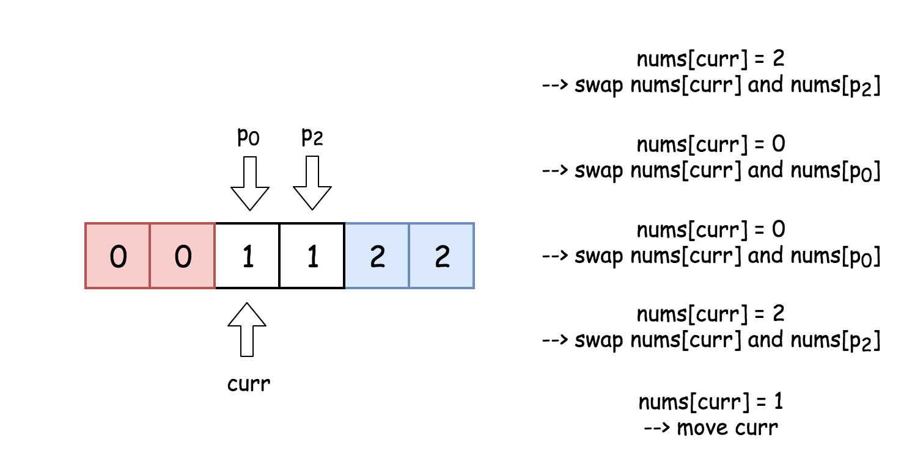
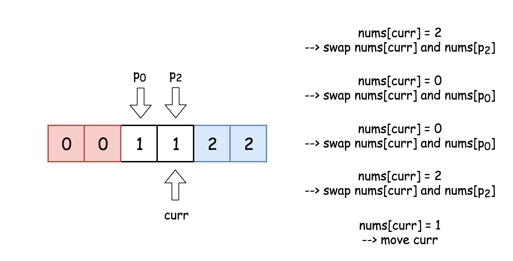
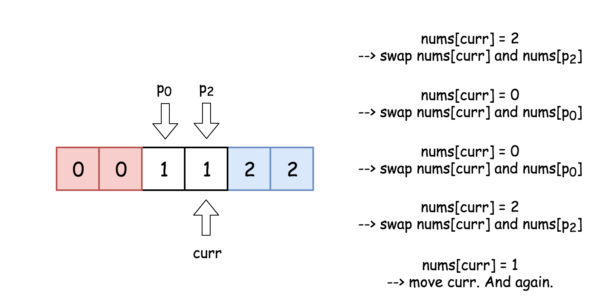

## [75. Sort Colors](https://leetcode.com/problems/sort-colors/)

### 1. Description

Given an array `nums` with `n` objects colored red, white, or blue, sort them in-place so that objects of the same color are adjacent, with the colors in the order red, white, and blue.

Here, we will use the integers `0`, `1`, and `2` to represent the color red, white, and blue respectively.

**Follow up:**

- Could you solve this problem without using the library's sort function?
- Could you come up with a one-pass algorithm using only $O(1)$ constant space?

**Example 1:**

```
Input: nums = [2,0,2,1,1,0]
Output: [0,0,1,1,2,2]
```

**Example 2:**

```
Input: nums = [2,0,1]
Output: [0,1,2]
```

**Example 3:**

```
Input: nums = [0]
Output: [0]
```

**Example 4:**

```
Input: nums = [1]
Output: [1]
```

**Constraints:**

- `n == nums.length`
- `1 <= n <= 300`
- `nums[i]` is `0`, `1`, or `2`.

### 2. Solutions

#### Solution 1: `Language: C` Two Pointers, One Pass

##### 2.1.1 Intuition

> The problem is known as [Dutch National Flag Problem](https://en.wikipedia.org/wiki/Dutch_national_flag_problem) and first was proposed by [Edsger W. Dijkstra](https://en.wikipedia.org/wiki/Edsger_W._Dijkstra). The idea is to attribute a color to each number and then to arrange them following the order of colors on the Dutch flag.


> Let's use here three pointers to track the rightmost boundary of zeros, the leftmost boundary of twos and the current element under the consideration.


> The idea of solution is to move `curr` pointer along the array, if `nums[curr] == 0` - swap it with `nums[p0]`, if `nums[curr] == 2` - swap it with `nums[p2]`.

##### 2.1.2 Algorithm

- Initialize the rightmost boundary of zeros : `p0 = 0`. During the algorithm execution `nums[idx < p0] = 0`.
- Initialize the leftmost boundary of twos : `p2 = n - 1`. During the algorithm execution `nums[idx > p2] = 2`.
- Initialize the index of current element to consider : `curr = 0`.
- While curr <= p2 :
  - If `nums[curr] == 0` : swap `curr`<sup>th</sup> and `p0`<sup>th</sup> elements and move both pointers to the right.
  - If `nums[curr] == 2` : swap `curr`<sup>th</sup> and `p2`<sup>th</sup> elements. Move pointer `p2` to the left.
  - If `nums[curr] == 1` : move pointer `curr` to the right.

##### 2.1.3 Implementation












- Saturday, 24 October, 2020
- Time Complexity: $O(n)$
- Space Complexity: $O(1)$
- *Runtime: 0 ms, faster than 100.00% of C online submissions for Sort Colors.*
- *Memory Usage: 6 MB, less than 99.26% of C online submissions for Sort Colors.*

```C
// Swap two integers by pointers.
void swap(int *a, int *b) {
    int temp = *a;
    *a = *b;
    *b = temp;
}

void sortColors(int *nums, int numsSize) {
    int curr = 0;
    int head = 0;
    int tail = numsSize - 1;
    while (curr <= tail) {
        // Case 1: current value is 0
        // Swap the current value with the head value to sort 0.
        // After swapping, both `head` and `curr` index should be added 1.
        // Because we could make sure from the start to head index, all values
        // are 0.
        if (nums[curr] == 0) {
            swap(&nums[curr++], &nums[head++]);
        // Case 2: current value is 2
        // Swap the current value with the tail value to make all 2 attach the end.
        // However, we only make the `tail` index minus one and keep the `curr` index.
        // Because the tail value has not been check, so we could not make sure
        // what is the value of the current one.
        } else if (nums[curr] == 2) {
            swap(&nums[curr], &nums[tail--]);
        // Case 3: current value is 1
        // Great, all 1 are in the middle. Go ahead.
        } else {
            curr++;
        }
    }
}
```
