# Introduction to Astronomy

*Hao Ren's learning notes which based on the course PHYS1160, UNSW 21T0.*

## 1. Introduction

### 1.1 Introduction to Astronomy

> The components of the universe (stars, planets and galaxies), the scale of the universe, a brief historical guide to the study of astronomy.

#### Astronomy

**Astronomy** is the scientific study of celestial objects — e.g. Planets, Stars, Galaxies, and the Universe as a whole.

**Tools:** Telescopes, Spacecraft, Computers, The Internet and Laboratories……

**Other "Astro" Words**: Astrology(Not Science), Astrophysics, Astrobiology, Astrometry and Astronautics.

#### Timeline

| Timeline          | Where / Who                   | What                                                                           |
|-------------------|-------------------------------|--------------------------------------------------------------------------------|
| Before 3000 BC    | Mesopotamia / Sumerians       | developed **the first form of writing** (cuneiform);                           |
|                   |                               | studied the motions of celestial bodies;                                       |
|                   |                               | developed the sexagesimal (base 60) system of numbers (time and angles).       |
| ca 4000 - 2000 BC | Southern England / Stonehenge | left structures with astronomical alignments with the rising and setting Sun on specific dates; |
|                   |                               | possibly involved in the keeping of time;                                      |
|                   |                               | or they may have served a more religious and/or ceremonial role.               |
| ca 580 - 500 BC   | Ancient Greece / Pythagoras   | developed **the geocentric model** that Earth is centre of Universal.          |
| ca 427 - 347 BC   | Plato and his pupil, Eudoxus  | In his model the Earth was at the centre and there were a series of concentric spheres carrying the Sun, Moon and planets, and an outer sphere carrying the fixed stars. |
|                   | The Greek philosophers        | developed increasingly complex systems of spheres carried on other spheres, or circles carried on larger circles, because it was clear that planetary motion could not be modelled  with a single circular motion about the Earth. |
| ca 100 - 170 AD   | **Claudius Ptolemy**          | wrote a treatise on astronomy known as *the Almagest* to explain the planetary motions reached its culmination, and it is the only comprehensive work on ancient astronomy to be preserved to the present day; |
|                   |                               | was best available geocentric model for the planetary motions.                 |
|                   |                               | **The Ptolemaic System [1]**                                                   |
| 1543 AD           | **Nicolaus Copernicus**       | published his book *De Revolutionibus Orbium Coelestium* (On the Revolutions of the Celestial Spheres), |
|                   |                               | proposed a model of the Solar system with the Sun, rather than the Earth, at the centre. But Copernicus still used the platonic idea of circular motions and so he still needed systems of multiple circles to explain the actual motions of the planets (which move on elliptical, rather than circular orbits). |
|                   |                               | **The Copernican (or Heliocentric) System [2]**                                |
| 1546 - 1601 AD    | Tyco Brahe                    | provided the result of astronomical observations which Kepler used as below.   |
| 1571 - 1630 AD    | **Johannes Kepler**           | provided the **final solution** to the problem of planetary motions;           |
|                   |                               | determined that the orbits of the planets were ellipses, not circles.          |
|                   |                               | **Kepler's Laws [3]**                                                          |
|                   | Hans Lippershey               | invented the telescope.                                                        |
| 1609 AD           | **Galileo Galilei**           | made his own telescope and observed the moons of Jupiter. The observations he made with it provided strong evidence in favour of the Copernican, Sun-centered, heliocentric model of the universe; |
|                   |                               | discovered the phase of Venus.                                                 |
|                   |                               | **The Phases of Venus [4]**                                                    |
| 1642 - 1726 AD    | **Isaac Newton**              | published his book *the Philosophiae Naturalis Principia Mathematica* in 1687; |
|                   |                               | found **a universal force of gravitation** that acts between any two objects in the universe and depends on their mass. |
|                   |                               | **The Universal Force of Gravitation [5]**                                     |
| 1838 AD           | Friedrich Bessel              | was first successful measured the stellar parallax of **the star 61 Cygni**, and obtained a distance of **9.8 light years**. |
| Rapidly Followed  |                               | **Alpha Centauri** was found to be the closest star system to our own Sun at a distance of about **4.3 light years**. |

**[1] The Ptolemaic System:**
    

**[2] The Copernican (or Heliocentric) System:**
    
    

**[3] Kepler's Laws:**
    

**[4] The Phases of Venus:**
    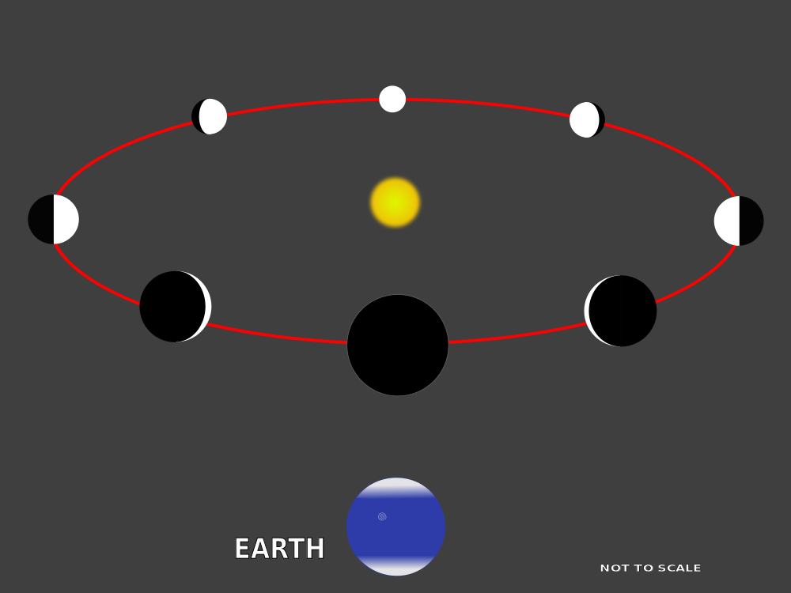

**[5] The Universal Force of Gravitation:**

#### Measuring the Distance between Stars

**Stellar parallax.** 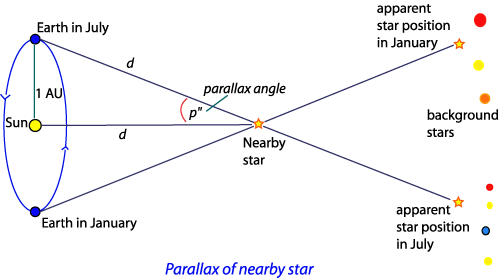

Not only was the Earth no longer at the centre of the universe, but even the Sun itself was just one of billions of stars making up our Milky Way galaxy. In fact it is now thought there are several hundred billions of stars in the Milky Way. With modern telescopes we can see galaxies out to distances of billions of light years, which means there are many billions of galaxies within our universe.

#### Astronomical Unit (AU)

The distance between the Sun and the Earth about $150,000,000$ km ($1.5 \times 10^{11}$ m).

#### Light Speed

$3 \times 10^{8}$ m/s.

#### Light Year

The **distance** that light travels in one year, about $9,460,700,000,000$ km ($63,241$ AUs).

#### Scale of the Solar System

It takes light about 8 minutes 20 seconds to get from the Sun to the Earth, and 4 hours to get from the Earth out to the orbit of Neptune.

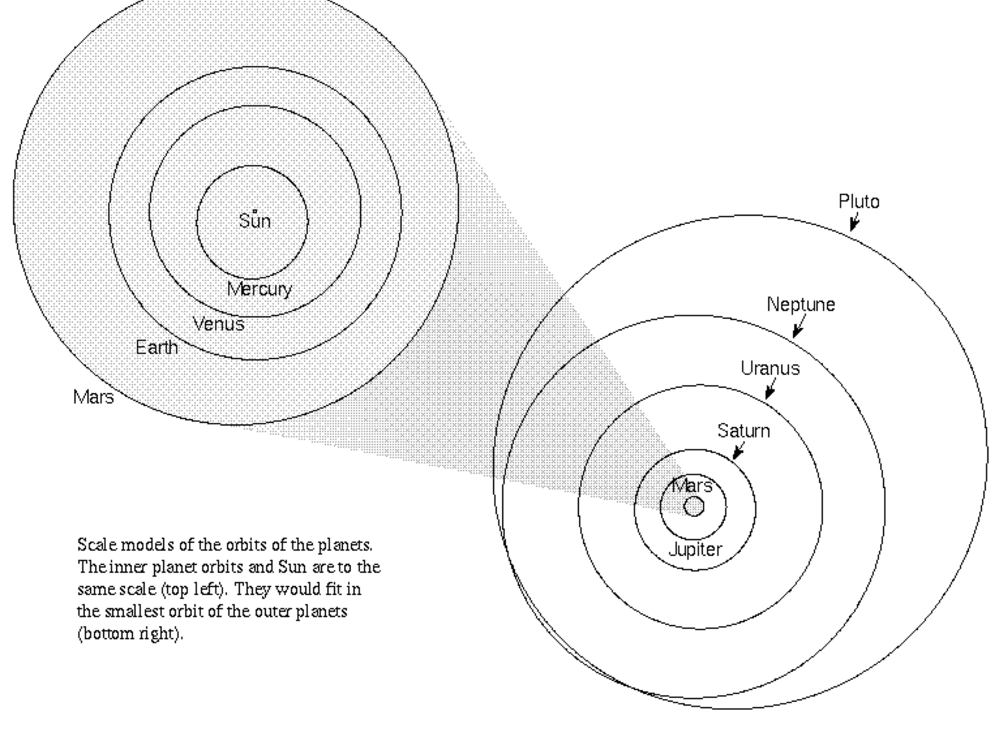

#### Scale of the Milky Way Galaxy

The Sun is about  25,000 light years from the centre of the galaxy. The Milky Way galaxy is a disk about 100,000 light years across, and it contains about 200 billion stars.

#### Scale of Galaxies and Clusters

There are dwarf galaxies containing only 100 million stars, and giant galaxies containing as many as 1 trillion stars.
- *Elliptical Galaxies*, which are just an elliptically shaped cloud of stars.
- *Spiral Galaxies* (our Milky Way galaxy is one), and these have a pattern of spiral arms. The spiral arms are the regions where new stars are forming.
- *Barred Spirals* where the spiral arms appear to originate from a bar spanning across the centre.
- *Irregular Galaxies* that have no particular shape. The **Large Magellanic Cloud** in one of these.
- *Clusters of Galaxies* where galaxies are clumped together in groups nonrandomly.
- *Super Clusters* where the clusters of galaxies are grouped together.

*Our own Milky Way galaxy is part of a small group of galaxies called the Local Group, and this is part of a much larger group of galaxies called the local super cluster.*

#### Anglo-Australian Telescope (AAT)

It used an instrument called the **Two-degree Field (2dF)**. 2dF was able to measure the spectra of 400 galaxies at one time. From the spectrum it is possible to determine the distance to each galaxy, and so plot these galaxies on a 3D map.

#### Hubble Space Telescope

More distant galaxies can be seen in deep exposures with it.

#### Summary

So in the 2000 years or so since the time of the ancient Greeks, we have gone from a universe that had the Earth at its centre, to a universe in which the Earth is just one planet orbiting a fairly ordinary star, which itself is just one of the hundreds of billions of stars in our galaxy, with our galaxy being just one of hundreds of billions within the universe as a whole.

### 1.2 Introduction to Astrobiology

> Why life might be common, or might be rare. The science of astrobiology. Where and how can we search for life in the universe?

#### Astrobiology

Astrobiology is the science of life in the universe.

**Life Might be Common** because of the vastness of the universe. The universe contains many billions of galaxies, and each galaxies contains many billions of stars.

**Life Might be Rare of Unique** because even the simplest living cell is extremely complex. According to one scientist it would be *"like a tornado blowing through a junkyard and assembling a Boeing 747"*.

**Number of planets with life $=$ Number of habitable planets $\times$ Probability of life's origin**

- For the number of habitable planets, we need to understand planets:
    - we need to understand how they formed,
    - whether they are likely to be habitable,
    - and how they evolve.
- This involves the sciences of:
    - astronomy,
    - planetary science,
    - and geology.
- But in order to get the probability of life's origin we need to understand life:
    - we need to understand how life works,
    - how it originates,
    - and how it evolves.
- So there we're looking at another set of sciences:
    - biology,
    - biochemistry,
    - and palaeontology.

#### Life of Earth

| Time              | Life of Earth                                                |
|-------------------|--------------------------------------------------------------|
| 3.5 billion years | in the form of microbial life – bacteria and similar things. |
| 500 million years | but complex life – macro organisms like animals and plants.  |
| 50,000 years      | modern humans.                                               |
| over 50 years     | technology to travel in space or to send signals in space.   |

#### Little Green Bacteria

If we can find just one example of life on another planet, say Mars, and show that it formed independently of life on Earth, even if it's only microbes, this proves that life forms easily, given the right conditions.

#### Astrobiology and Astrobiologists

- Astrobiology inherently involves an interdisciplinary approach.
- One study is to <u>look at possible locations for life in our Solar system</u>, and these are actually growing as we learn more about the Solar system.
- Astrobiologists are involved in the <u>search for planets around other stars</u>, and the study of these planets. **We went past 3499 such planets known in 2017, and this number is growing all the time.**
- Astrobiology also involves the <u>study of the early history of life on Earth</u>.
- And astrobiology also includes the <u>study of life in extreme conditions</u>.

#### Follow the Water

- Water is an abundant molecule in the Universe.
- Liquid water is a great solvent for chemical reactions.
- It is easier to identify life that is similar to our own.

#### Water and Life Searching

Everywhere we look on Earth, liquid water seems to be the only fundamental requirement for life. Living cells themselves are essentially drops of water contained in a cell membrane, and all of the chemistry fundamental to life, occurs in solution in water. Life can be found in extreme conditions (called extremophiles), from superheated water near hydrothermal vents, to near-freezing water in the Antarctic, but the one fundamental requirement is that water has to remain liquid.

- **Mars:**
    - 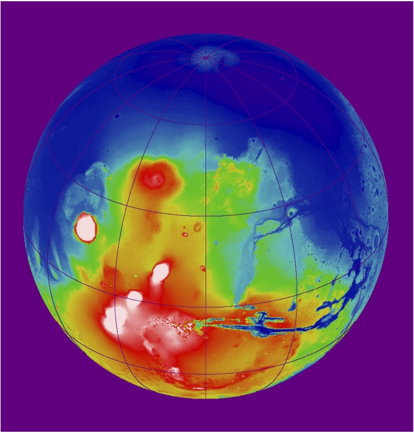
    - Evidence of water comes from features on the surface of the planet which look very much like dry river beds even in the distant past.
    - **NASA's Mars Phoenix Lander:** The Mars Phoenix spacecraft landed in the Mars polar regions in 2007, and it found clear evidence for ice under the surface and test the material was water ice.
    - **Mars Rovers:** We believe that a long time ago, 3.5 billions years or more, Mars did have water flowing on the surface, and at that time would have been a promising location for life to exist.
    - **Mars Spirit and Opportunity:** They arrived on the surface in 2004, and Opportunity is operated until 2018 despite being only designed for a mission a few months long.
    - **Mars Curiosity:** The Mars Science Laboratory (Curiosity) which is the largest rover to date arrived on the surface, delivered by sky crane, in 2011.
    - **ExoMars:** In planning by the European Space Agency which will also be a rover that will be sent to Mars and will include a drill that can collect samples from below the surface of the planet, the place where we think life is more likely to be preserved.
- **Europa:**
    - Europa is Jupiter's moon that the existence of the ice surface with an ocean beneath was being trusted by astrobiologists.
    - The ocean beneath perhaps under several kilometres of ice – we don't quite know what the thickness is.
    - The relatively smooth cracked surface is evidence that Europa doesn't seem to have many craters like many of the objects in the outer-Solar system have, which means its body is relatively young.
    - What we think is happening is that the surface cracks and the ocean comes up from beneath the surface and refreezes making a fresh surface, and that can only occur if there is ocean underneath the ice.
    - Geysers erupting from the surface have been confirmed to be water, which adds further weight.
    - So what might be possible, eventually, is that we might be able to send probes that would melt their way through the ice, descend into the ocean, and explore the oceans underneath the ice. But that's probably some way into the future.
    - Currently planned missions aim to confirm the existence of the ocean and determine the thickness of the ice.
- **Extrasolar Planets and the Kepler Satellite:**
    - Extrasolar planets (or exoplanets) are planets that orbit other stars. **In 2014 we passed 1500 found exoplanets.**
    - Kepler satellite was launched to find planets around other stars that could be habitable planets.
    - Kepler observed simultaneously 100,000 stars and looked for a dip in the light as a planet passed in front.
    - Eg: Kepler-452b

#### The Habitable Zone

"Habitable" planets are those that have suitable conditions on their surface for liquid water to exist. We call this region around the star the "habitable zone". In our Solar system, currently, Mars is too cold and Venus is too hot. The habitable zone is sometimes also referred to as "the Goldilocks zone" after the fairytale of Goldilocks and the three bears. **The Solar system's habitable zone encompasses only Earth. Venus is too hot and Mars too cold for liquid water.**

#### The Direct Detection of Earth-Like Planets

Kepler's method is an *indirect way of detecting planets*, and the next step is to use either giant ground based telescopes or space based instruments to look directly at other star systems and try to look in particular for biosignatures in the atmospheres of planets. Biosignatures such as oxygen are indicators of life. **Oxygen is only present in the Earth's atmosphere because its made by living organisms. Plants and other photosynthetic bacteria produce oxygen.**

#### Telescopes for Life Searching

| Detection Systems                           | Type                   | What                                                     |
|---------------------------------------------|------------------------|----------------------------------------------------------|
| OverWhelmingly Large Telescope (OWL)        | Ground-based Telescope | was estimated that an aperture of 100 m would be needed; |
|                                             |                        | ESO decided that such a telescope was beyond what was currently feasible and are proceeding with their E-ELT telescope with smaller 39 m aperture. |
| European Extremely Large Telescopes (E-ELT) | Ground-based Telescope | is proceeding currently with an aperture of 39 m.        |
| Very Large Telescope (VLT)                  | Ground-based Telescope | was being operating now by ESO. (In using.)              |
| NASA - Terrestrial Planet Finder (TPF)      | Instruments in Space   | There were two different variants of this using two different techniques. But both have the aim of detaching terrestrial like planets and searching them for biosignatures that would indicate the presence of life. |
|                                             |                        | these missions also have proved too difficult and expensive, and are no longer being actively developed. |
|                                             | TPF-Coronograph        | TPF-C Large (8$\times$3.5 m) using a coronograph;        |
|                                             |                        | and the idea of the coronograph is to get rid of the star and reveal the light of the planet, which might be a billion times or more fainter than the star. |
|                                             | TPF-Interferometer     | multiple 3 to 4 m telescopes flying in formation;        |
|                                             |                        | combining light of planets together using a technique called interferometry, which again has the goal of getting rid of the light of the star to reveal the planet. |

With either of the TPF or OWL systems, the aim would be to both detect the planet, and also  search for indications of the presence of life. In all 3 planets we detect the presence of a feature due to carbon dioxide. Carbon dioxide shows that the planets have atmospheres with carbon dioxide in them, but in the case of the Earth, and only the Earth, we see some additional features. We see a feature due to water vapour, which shows the presence of water on the Earth, and for the Earth we see a feature due to the absorption of ozone. Ozone is only there because there is oxygen in the atmosphere, oxygen gets converted into ozone. **And therefore ozone is an indicator of a planet with life.** So that's how this technique can be used to detect the possible presence of life on a distant extrasolar planet.

#### Search for Extraterrestrial Intelligence (SETI)

By looking for signals sent by intelligent civilizations elsewhere in the galaxy to search for life.

| SETI Projects                    | What                                                                           |
|----------------------------------|--------------------------------------------------------------------------------|
| Project Phoenix                  | involved searching 800 nearby stars using 3 different radio telescopes;        |
|                                  | and the result is that no extraterrestrial signals were detected.              |
| Parkes Radio Telescope           | located in Australia which was used as a part of *Project Phoenix*.            |
| Allen Telescope Array            | has very high sensitivity by using a large number of smaller dishes rather than a single big dish. |
| The Square Kilometre Array (SKA) | is a huge radio telescope being developed as part of an international project. |
| Breakthrough Listen              | has just been start.                                                           |

### 1.3 Key Concepts

> Forces and Energy, Gravity, Orbits and Kepler’s laws. Atoms and nuclei. Light and other electromagnetic waves.

*Forget the lecture notes. This notes is much better than it in physics.*

#### Newton's Laws of Motion

- **Newton's first law:** The first law states that as object at rest will stay at rest, and an object in motion will stay in motion unless acted on by a net external force. $$\mathbf{\sum{F}} = 0 \quad\leftrightarrow\quad \dfrac{\mathrm{d}\mathbf{v}}{\mathrm{d}t} = 0$$
- **Newton's second law:** The second law states that the rate of change of momentum of a body over time is directly proportional to the force applied, and occurs in the same direction as the applied force. $$\mathbf{F} = \dfrac{\mathrm{d}\mathbf{p}}{\mathrm{d}t}$$ For objects and systems with constant mass, it can be re-stated in terms of an object's acceleration. $$\mathbf{F} = \dfrac{\mathrm{d}(m\mathbf{v})}{\mathrm{d}t} = \dfrac{\mathrm{d}\mathbf{v}}{\mathrm{d}t} = m\mathbf{a},$$ where $\mathbf{F}$ is the net force applied, m is the mass of the body, and $\mathbf{a}$ is the body's acceleration. Thus, the net force applied to a body produces a proportional acceleration.
- **Variable-mass systems** is the motion for a body whose mass $m$ varies with time, the formula is $$\mathbf{F} + \mathbf{u}\dfrac{\mathrm{d}m}{\mathrm{d}t} = \dfrac{\mathrm{d}\mathbf{v}}{\mathrm{d}t},$$ where $\mathbf{u}$ is the **exhaust velocity** of the escaping or incoming mass relative to the body. E.g. a rocket burning fuel and ejecting spent gases (*The Tsiolkovsky Rocket Equation*).
- **Newton's third law:** The third law states that all forces between two objects exist in equal magnitude and opposite direction, which could be state as $$\mathbf{F}_{A}= -\mathbf{F}_{B}.$$

#### The Universal Law of Gravitation

Gravity is a universal force that acts between any pair of objects in the universe which depends on the mass of the two objects, and on their distance apart – varying as the inverse square of the distance. $$\mathbf{F} = G\dfrac{m_{1}m_{2}}{r^{2}},$$ where $\mathbf{F}$ is the gravitational force acting between two objects, $m_{1}$ and $m_{2}$ are the masses of the objects, $r$ is the distance between the centers of their masses, and $G = 6.67 \times 10^{-11} \mathrm{N \cdot m^{2}/kg^{2}}$ is the gravitational constant. The first implicit measurement with an accuracy within about 1% is attributed to Henry Cavendish in a 1798 experiment.

#### Formulas of the Circular Motion

|                                    | Formulas                                                                              |
|------------------------------------|---------------------------------------------------------------------------------------|
| Angular Velocity                   | $\mathbf{\omega} = \dfrac{2\pi}{T} = 2 \pi f = \dfrac{\mathrm{d}\theta}{\mathrm{d}t}$ |
| Linear Velocity                    | $\mathbf{v} = \dfrac{2 \pi r}{T} = \mathbf{\omega} r$                                 |
| Swept Angle                        | $\theta = 2 \pi \dfrac{t}{T} = \mathbf{\omega} t$                                     |
| Angular Acceleration               | $\mathbf{\alpha} = \dfrac{\mathrm{d}\mathbf{\omega}}{\mathrm{d}t}$                    |
| Acceleration by Direction Changing | $\mathbf{a_{c}} = \dfrac{\mathbf{v}^{2}}{r} = \mathbf{\omega} ^{2}r$                  |
| Centrifugal Force                  | $\mathbf{F_{c}} = \dot{p} \overset{{\dot{m}}=0}{=} m \mathbf{a_{c}} = \dfrac{m \mathbf{v}^{2}}{r}$ |
| Vector Cross Product Velocity      | $\mathbf{v} = \mathbf{\omega} \times \mathbf{r}$                             |
| Vector Cross Product Acceleration  | $\mathbf{a} = \mathbf{\omega} \times \mathbf{v}$                             |

#### Orbits

There are a few common ways of understanding orbits:
- A force, such as gravity, pulls an object into a curved path as it attempts to fly off in a straight line.
- As the object is pulled toward the massive body, it falls toward that body. However, if it has enough tangential velocity it will not fall into the body but will instead continue to follow the curved trajectory caused by that body indefinitely. The object is then said to be orbiting the body.
- **First Cosmic Velocity:** known as the orbital velocity, will bring a rocket or other projectile into orbit around the Earth. The gravity of the earth on an object is exactly equal to the centripetal force of the object in motion, so we can state that $$G\dfrac{Mm}{R^{2}} = m\dfrac{\mathbf{v}_{1}^{2}}{R^{2}} \quad\leftrightarrow\quad \mathbf{v}_{1} = \sqrt{\dfrac{GM}{R}} = 7.9 \mathrm{km/s},$$ for the earth.
- **Second Cosmic Velocity:** known as the escape velocity. The potential energy on the surface of earth is $-G\dfrac{Mm}{R}$; and the velocity when the object escape from the earth is zero. So the mechanical energy, which is the sum of kinetic energy and potential energy, should also be zero. The formula is $$\dfrac{1}{2} m \mathbf{v}_{2}^{2} - \dfrac{GMm}{R} = 0 \quad\leftrightarrow\quad \mathbf{v}_{2} = \sqrt{\dfrac{2GM}{R}} = \sqrt{2gR} = 11.2 \mathrm{km/s}$$ for the earth.
- **Third Cosmic Velocity:** known as the minimum velocity to escape from the solar system. When the earth revolves around the sun, all objects on the earth have an initial velocity which is $29.8 \mathrm{km/s}$. So the total energy that object needed is $$\frac{1}{2}m \mathbf{v}_{3}^{2} = \frac{1}{2}m \mathbf{v}_{2}^{2} +\frac{1}{2}m \Delta \mathbf{v}^{2} \quad\leftrightarrow\quad \mathbf{v}_{3} = \sqrt{11.2^{2} + 12.3^{2}} = 16.7 \mathrm{km/s}.$$

#### Kepler's Laws of Planetary Motion

- **First law:** The orbit of every planet is an ellipse with the Sun at one of the two foci.
- **Second law:** A line joining a planet and the Sun sweeps out equal areas during equal intervals of time. 
- **Third law:** The ratio of the square of an object's orbital period with the cube of the semi-major axis of its orbit is the same for all objects orbiting the same primary. By expressing the angular velocity in terms of the orbital period we find $$mr(\dfrac{2 \pi}{T})^{2} = G\dfrac{mM}{r^{2}} \quad\rightarrow\quad T^{2} = \dfrac{4 \pi ^{2}}{GM}r^{3} \quad\rightarrow\quad T^{2}\propto r^{3}.$$ A more detailed derivation can be done with general elliptical orbits, instead of circles, as well as orbiting the center of mass, instead of just the large mass. This results in replacing a circular radius, $r$, with the semi-major axis, $a$, of the elliptical relative motion of one mass relative to the other, as well as replacing the large mass $M$ with $M + m$. The full corresponding formula is $$\dfrac{a^{3}}{T^{2}} = \dfrac{G(M+m)}{4 \pi ^{2}} \approx \dfrac{GM}{4 \pi ^{2}} \approx 7.496 \times 10^{-6} (\dfrac{{\text{AU}}^{3}}{{\text{days}}^{2}}) \text{ is constant.}$$

#### Energy

It defined as the “capacity to do work”. The formula is $$W = \mathbf{F} \times \mathbf{x},$$ which $W$ is the work, $F$ is the force applied on the object, and $x$ is the displacement. In addition, energy comes in many different types, such as Mechanical Energy, Thermal Energy, Chemical Energy, Electromagnetic Energy and Nuclear Energy……

#### Momentum ($\mathbf{p}$) and Impulse ($\mathbf{I}$)

$$\mathbf{p} = m \mathbf{v} = \mathbf{I} = \int \mathbf{F} \mathrm{d}t.$$

#### Conservation of Energy

Energy cannot be created or destroyed. It can only be converted from one form to another.

#### Conservation of Momentum

In a closed system (one that does not exchange any matter with its surroundings and is not acted on by external forces) the total momentum is constant. $$m_{1} \mathbf{u}_{1} + m_{2} \mathbf{u}_{2} = m_{1} \mathbf{v}_{1} + m_{2} \mathbf{v}_{2}.$$

The mechanical energy of a system is the sum of the **potential energy** (which is measured by the position of the parts of the system) and the **kinetic energy** (which is also called the energy of motion): $$E_{\mathrm{mechanical}} = E_{\mathrm{potential}} + E_{\mathrm{kinetic}},$$ it remains constant in time as long as the system is free of friction and other non-conservative forces.

#### Atoms

- Atomic Nucleus (+):
    - Protons (+) - positively charged particles.
    - Neutrons - electrically neutral particles.
- Electrons (-) - very light negatively charged particles.

#### Isotopes

Atoms that have the same number of protons in the nucleus but a different number of neutrons.

#### Molecules

Atoms combine together to form molecules.

#### Different Phases of Matters

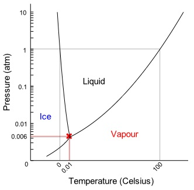

#### Ideal Gas Law

$$PV=nRT$$ where $P$, $V$ and $T$ are the pressure, volume and temperature; $n$ is the amount of substance; and $R$ is the ideal gas constant.

#### Electromagnetic Radiation

$$f = \frac{1}{T} = \frac{\mathbf{v}}{\lambda},$$ where $f$ is the frequency, $T$ is the period, $\mathbf{v}$ is the velocity of wave and $\lambda$ is the wavelength.

#### Amplitude

The amplitude of a periodic variable is a measure of its change in a single period (such as time or spatial period). There are various definitions of amplitude, which are all functions of the magnitude of the differences between the variable's extreme values.

#### Standing Wave

Standing wave is a wave which oscillates in time but whose peak amplitude profile does not move in space. The peak amplitude of the wave oscillations at any point in space is constant with time, and the oscillations at different points throughout the wave are in phase. The locations at which the absolute value of the amplitude is minimum are called nodes, and the locations where the absolute value of the amplitude is maximum are called antinodes.

#### Thermal Radiation

Thermal radiation is one of the main sources of the electromagnetic radiation. Stars also emit thermal radiation. The temperature of a star determines its colour. The simulation below allows you to change the temperature of a star and observe how this affects the wavelengths of the peak of intensity of emission coming from the star. For example very hot stars will emit most radiation in blue and this is why we see them as bluish in colour. Cooler stars emit their energy mostly in red and this is why they appear reddish.

#### Wien Displacement Law

Wien's displacement law states that the black-body radiation curve for different temperatures will peak at different wavelengths that are inversely proportional to the temperature. The shift of that peak is a direct consequence of the Planck radiation law, which describes the spectral brightness of black-body radiation as a function of wavelength at any given temperature.

According to Wien Displacement Law the maximum wavelength of thermal radiation is inversely proportional to the temperature of the object. The curve has maximum at shorter wavelengths and the intensity of this maximum gets higher when the temperature goes up; and the maximum is at longer wavelengths and its intensity gets lower when the temperature goes down. We can state that $$\lambda_{peak} = \dfrac{b}{T},$$ where T is the absolute temperature. $b$ is a constant of proportionality called Wien's displacement constant, approach to $2.898 \times 10^{-3}$ m⋅K.

### 1.4 Techniques of Astronomy

> Telescopes and instruments for different wavelength regions. Observing methods. Spectra and the Doppler shift. Effect of the atmosphere. Observations from space.

#### Telescopes Types

1. Refracting Telescopes:
    - 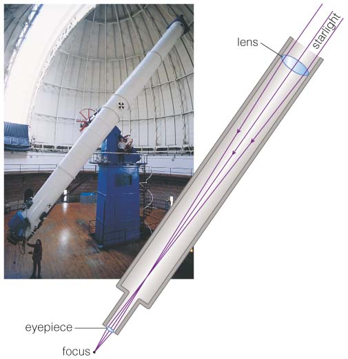
    - The 1 m refractor telescope at Yerkes Observatory in Chicago is the largest such telescope.
    - It is really not feasible to make refracting telescopes any bigger than about 1 m in aperture, because the lens simply deforms under **its own weight**.
2. Reflecting Telescopes:
    - 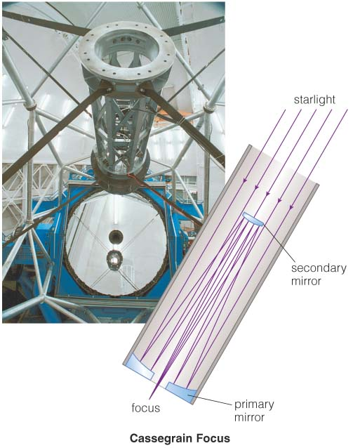
    - Reflecting telescopes use a curved mirror instead of a lens to focus light.
    - Larger mirror could be made and hold steadily compared with the lens by support edges.
3. Others:
    - Telescopes were first used by Galileo in 1609, and it is a refracting telescope.
    - The **aperture** is the diameter of a primary mirror or primary lens of the telescope.
    - **The light collecting power** of the telescope is determined by the area of its collecting mirror or lens, which in turn depends on the aperture of the telescope.
    - For example, a lens that’s twice as big will collect four times as much light because its area is four times larger.
    - **The resolving power** of the telescope, which is the telescope’s ability to see fine detail, is also depending on the aperture.
    - Astronomers are always wanting to build bigger telescopes.

#### Large Optical Telescopes

| Year       | Name                       | Aoerture       | Image                                                |
|------------|----------------------------|----------------|------------------------------------------------------|
| 1917       | Mount Wilson 100"          | 2.5 m (100")   |  |
| 1948       | Hale Telescope             | 5 m (200")     |    |
| 1996       | Keck Telescopes            | 10 m           |    |
| Developing | Extremely Large Telescopes | 20, 30 or 40 m |                                                      |
| 1974       | Anglo Australian Telescope | 3.9 m          |     |

#### Observation Techniques History

- Visual Observation: It is subjective and could be influenced by pre-conceptions, by optical illusions, and just by poor eyesight. Eg. Percival Lowell found the *not existed* canals on the Mars.
- Photography: Long exposures could be used to record much fainter objects.
- Electronic Devices: Use Charge Coupled Devices (CCDs) which has better sensitivity and could be stored in computers.

#### CCD Cameras in Astronomy Observation

- A focal length far longer than any normal camera lens. Eg. Keck Telescope has a focus 15 m (150,000 m).
- Using arrays of detectors to obtain images with vast numbers of pixels could be hundreds of mega-pixels.
- Astronomical Telescope has usually been cooled with liquid nitrogen or closed cycle coolers to shallow temperatures. So an astronomical CCD is generally mounted in a dewar.

*Imaging observations can be used to study the structure of objects such as galaxies and nebulae. The images can be used to measure the brightness of stars and by using images made at different wavelengths through different filters we can measure the colours of stars – this is a technique that is called photometry. You can use the images to measure positions of objects and this is useful, for example, for looking for the motion of the objects that can be due to stellar parallaxes or proper motion.*

#### Spectrographs

The spectrograph is sitting at the base of the telescope receiving the light from the telescope. And it consists of a slit, which is a narrow opening that allows the light from a single star to pass through into the spectrograph. the light from the slit goes to a collimator which makes the rays of light parallel, and then that parallel beam of light is fed to the diffraction grating, and the dispersed spectrum comes off the diffraction grating and goes to another curved mirror – which is a camera mirror – and focusses the spectrum onto a CCD detector. The CCD then records an image of the spectrum of the light of the star.

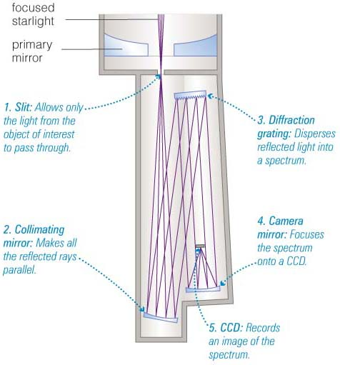

#### Theorem of Spectral Lines

The importance of a spectrum is that we can see the signatures of individual atoms and molecules through what are called spectral lines.

Spectral lines are discrete wavelengths at which a particular atom or molecule can emit or absorb radiation and they are related to energy levels in the atom or molecule. Electrons in an atom can gain or loose only a specified amount of energy.

This specific amounts of energy are govern by the rules of quantum mechanics. Each atom or molecule has a set of energy levels that an electron can jump onto. As a result of these quantum rules electron can only absorb or emit exactly as much energy as it is needed to account for a difference between two different energy levels.

When the electron in an atom jumps between one energy level and another it can emit light of a particular wavelength and it can absorb light of a particular wavelength. When light is emitted this means that the electron lost energy and jumped to a lower energy level. When the light is absorbed the electron gained energy and it is now on a higher energy level.

These spectral lines show as the dark or bright lines across the spectrum.

#### Types of Spectra

- **Continuous Spectrum:**
    - It obeys Wien's Law, which has been noted at the end of [Chapter 1.3](#wien-displacement-law). Eg. We move it further to the blue if we increase temperature.
    - Atoms are emitting light of all wavelengths in such packed environment because atoms collide very often, and electrons can exist in many different energy states. That depends only on the amount of thermal energy available for them, which depends on the temperature of the object.
- **Emission Line Spectrum:**
    - This is what we observe when we look at the spectrum of a rarified gas that is hot, so it is glowing. The spectrum emits light at a few specific wavelengths. And we look at different gases we see a different spectrum. Eg. Neon has a different pattern of lines than hydrogen.
    - In a gas of low density collisions are relatively rare. The atoms that gain energy above their normal levels are called excited. This energy could have been gained by higher energy radiation from a nearby source, or just due to these rare collisions. When electrons loose this excess energy, emission lines are observed. Certain energy levels are more likely to be occupied than others in a low density gas (with limited collisions). This is why we are more likely to see emission from these level that translate into specific wavelengths at which lines are observed.
- **Absorption Line Spectrum:**
    - An absorption line spectrum that arises where we have a source of the continuous spectrum (like a light globe or the Sun) and we look at it through a cloud of gas. In this case gas absorbs light of specific wavelengths. These wavelengths are the same as the wavelengths of emission lines in a hot gas of the same composition.  The result is that we have a spectrum that is a combination of the continuous spectrum from the globe and the absorption spectrum from the gas.
    - If we look at different gases we will see different absorption lines. Thus the spectral lines are the signatures of specific elements, and this is how we can learn about the composition of different gases through spectroscopy.

#### Doppler Effect

In classical physics, where the speeds of source and the receiver relative to the medium are lower than the velocity of waves in the medium, the relationship between observed frequency $f$ and emitted frequency $f_{0}$ is given by: $$f = \left(\dfrac{c \pm v_{r}}{c \pm v_{s}}\right)f_{0}$$ where
- $c$ is the propagation speed of waves in the medium;
- $v_{r}$ is the speed of the receiver relative to the medium, added to $c$ if the receiver is moving towards the source, subtracted if the receiver is moving away from the source;
- $v_{s}$ is the speed of the source relative to the medium, added to $c$ if the source is moving away from the receiver, subtracted if the source is moving towards the receiver.

Note this relationship predicts that the frequency will decrease if either source or receiver is moving away from the other.

Equivalently, under the assumption that the source is either directly approaching or receding from the observer: $$\dfrac{f}{v_{wr}} = \dfrac{f_{0}}{v_{ws}} = \dfrac{1}{\lambda}$$ where
- $v_{wr}$ is the wave's velocity relative to the receiver;
- $v_{ws}$ is the wave's velocity relative to the source;
- $\lambda$ is the wavelength.

#### Timing Observations

Timing observation is when we look at how some property of an object varies with time. One common example is observing the variations in the brightness of a variable star. If we make observations at many different times, we can plot it out against time, and this results in what’s called a light curve – a plot of brightness against time.

#### Problems of Ground-based Telescopes

All ground-based telescopes have to contend with the effects of looking through the Earth’s atmosphere and this causes a number of problems for observing.
- The atmosphere absorbs radiation of some wavelengths of light.
- The effect of turbulence in the Earth’s atmosphere might blurs images.
- Cloud could make observations not possible by getting in the way.

#### Radio Telescopes and Interferometers

- **Radio Telescopes:**
    - It really started just after World War 2 and built on new techniques that had been developed during the war for things such as RADAR.
    - Radio telescopes observe the sky at radio wavelengths, so that means wavelengths from cm to m.
    - The dish in a radio telescope reflects radio waves in exactly the same way a mirror in an optical telescope reflects visible light.
    - Sensitive radio receivers are mounted at the focus of the dish and receive the reflected radio signals.
    - Big dishes needed to obtain good resolving power which scales with the wavelength. So for long wavelengths you need a much larger telescope than you need at short wavelengths for optical astronomy.
- **Interferometers:**
    - An interferometer has multiple dishes, their signals are combined electronically.
    - A system can provide **the same resolution (or ability to see fine detail) of a telescope much bigger than any of the individual dishes**, in effect it can be like a telescope several km across.
    - However, **the sensitivity  (i.e. the ability to see faint radio sources) is only determined by the actual collecting area of the combined dishes**.

#### Observatory Sites and Radio Telescopes

| Name                              | Location     | Properties                                                                                       |
|-----------------------------------|--------------|--------------------------------------------------------------------------------------------------|
| Mauna Kea Observatory             | Hawaii       | At high altitude 4000 m, not too much water vapour and good seeing.                              |
| Parkes                            | NSW          | Build in 1960, a radio dish 64 m in diameter which is Australia's major astronomical facilities. |
| Radio telescope at Arecibo        | Puerto Rico  | Until recently the largest single dish of 305 m diameter.                                        |
| FAST                              | China        | A single dish of 500 m diameter currently designed and built.                                    |
| Australia Telescope Compact Array | Narrabri NSW | Interferometer has multiple dishes, their signals are combined electronically.                   |

#### Telescopes in Space

*Visible light, radio waves and some infrared wavelengths can be observed from ground based telescopes as we’ve seen – they get through the Earth’s atmosphere. But many other wavelengths, and these include gamma-rays, X-rays, ultraviolet, and some infrared wavelengths, can only be observed from space. So, space telescopes are used for these observations. In fact, space telescopes can also provide improved data even at visible wavelengths.*

| Name                   | Properties                                                                                       | Imaged by Telescopes |
|------------------------|--------------------------------------------------------------------------------------------------|----------------------|
| Hubble Space Telescope | The HST was launched in 1990 from the Space Shuttle Atlantis and running in an orbit that astronauts could improve by the space shuttle. It’s a telescope that operates at **ultraviolet wavelengths** that are waves can only be observed from space.  But it also works at **visible wavelengths**. | 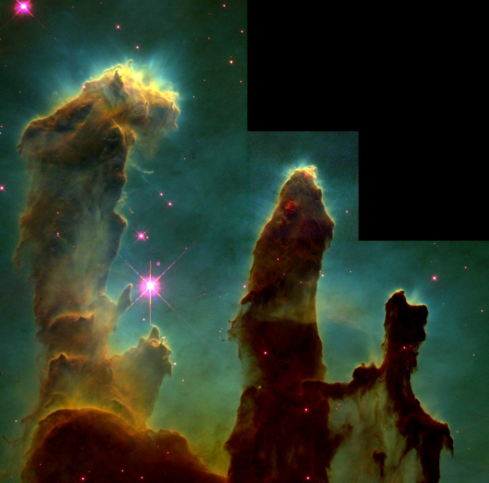 |
| Spitzer                | Spitzer is a 0.85 m aperture **infrared** telescope.  The atmosphere is bright in the telescope observation because even low-temperature objects emit at infrared wavelengths. The whole telescope is cryogenically cooled so that the infrared background radiation from the telescope is minimal and because the atmosphere has been got rid of this makes it extremely sensitive to infrared radiation. | 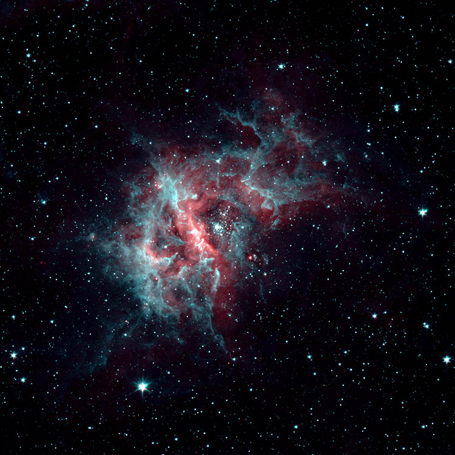 |
| Chandra                | Another example of a space telescope is the Chandra **X-ray** telescope. At X-ray wavelengths, you can’t use a conventional telescope design because you can’t reflect X-rays with a mirror. X-rays can only be reflected at grazing angles of incidence, so the type of mirrors used in the X-ray telescope are these nested cylinders where the X-rays come in and are reflected at these very shallow angles. This creates an X-ray telescope with an effective focal length of about 10 m, producing an image at its focus that can then be detected by special X-ray detectors. |  |

#### Gravitational Waves

A major advance in astronomy was reported on Feb 11th 2016 when a large consortium of scientists reported the first detection of gravitational waves from space. These are waves in the fabric of spacetime predicted by Einstein's general theory of relativity 100 years earlier.

## 2. The Solar System

### 2.1 The Solar System

> Introduction to the solar system. Terrestrial and giant planets, satellites, dwarf planets., small solar system bodies. The formation of the solar system.

#### Earth, Sun and Other Components

- A key feature of the Earth, is that it is the only place we know that hosts life.
- The Earth orbits a star called the Sun.
- The energy that comes from the Sun is fundamental to life. All living organisms depend on energy and all of that energy, in almost every case, originally comes from the Sun.
- There are now only 8 proper, fully-fledged planets in our Solar System.
- 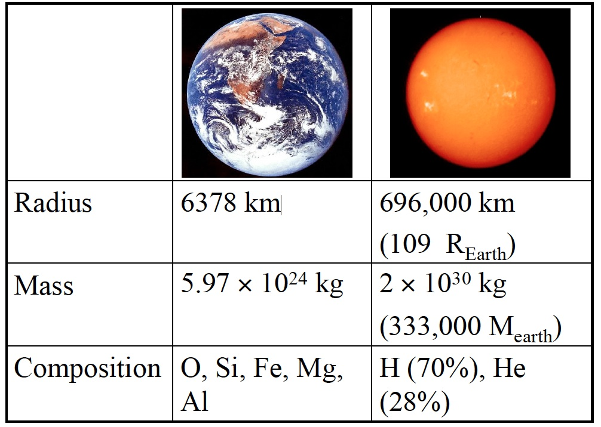

| Name                      | Radius               |
|---------------------------|----------------------|
| Terrestrial planets       | 0.4 to 1.5 AU        |
| The main asteroid belt    | 2 to 4 AU            |
| Giant planets             | 5 to 30 AU           |
| The Edgeworth-Kuiper belt | 35 to 500 AU         |
| The Oort cloud            | From Sun to 50000 AU |

#### Inner Solar System

| Planets     | Key Features                                                                                                                           |
|-------------|----------------------------------------------------------------------------------------------------------------------------------------|
| **Mercury** | Mercury is the closest planet to the Sun which has be explored by NASA Messenger in 2011.                                              |
| **Venus**   | The European Space Agency Venus Express spacecraft reached orbit around Venus in 2006 and made observations.                           |
|             | The Venus is similar to the earth in both size and mass. And It is completely covered with clouds that extend to an altitude of 70 km. |
|             | There is a very dense atmosphere composed mainly of **carbon dioxide (CO2)**.                                               |
|             | The atmosphere on Venus which make the pressure reaches up to 90 times that on the Earth at the surface of the planet.                 |
| **Earth**   | 70% surface is covered by oceans and it has clouds of liquid water. The Earth is an example of what we call a "habitable planet".      |
|             | Earth is that it is the only terrestrial planet that has a large moon. The Moon is about a quarter of the radius of the Earth.         |
|             | This is a very large relative size, and the Earth-Moon system is often thought of as a **double planet**.                              |
| **Mars**    | It has a thin atmosphere composed mainly of **carbon dioxide** with **occasional clouds**.                                             |
|             | It has polar caps are composed partly of **carbon dioxide ice**, as a result of the Martian air freezing out on the polar caps.        |
|             | Under these CO2 caps, there are also permanent polar caps made of water ice.                                                |
|             | Mars has some areas: large plains, extinct volcanoes (with the largest volcanoes in the Solar System - Olympus Mons) and canyon systems, which could have been eroded by liquid water in the early history of the planet. |
|             | Its moons (Deimos and Phobos) are tiny, and are probably captured asteroids. They were discovered by Asaph Hall in 1877.               |

#### Outer Solar System

All four outer planets have ring systems. Though Saturn's are by far the most prominent, Jupiter also has a faint ring system as does Uranus and Neptune.

| Planets     | Key Features                                                                                                                           |
|-------------|----------------------------------------------------------------------------------------------------------------------------------------|
| **Jupiter** | Jupiter is a gas giant or "Jovian" planet. This means it has no solid surface and is almost entirely made of gas.                      |
|             | It is possible that it has a small and enormously compressed rock/ice core at its centre.                                              |
|             | However, this core would be a very small fraction of the total mass of the planet.                                                     |
|             | Most of the planet is made of **hydrogen (H2) and helium gas (He)**, with a similar composition to the Sun. And a few other molecules in Jupiter's composition, such as **methane (CH4) and ammonia (NH3)**. |
|             | The fact that Jupiter is made of gas means that its density is very low compared with the terrestrial planets.                         |
|             | The spots and features we see on it are permanent storm systems are the larger active cyclones than we get on the Earth.               |
|             | Jupiter has a large system of more than 70 moons, and this is a general feature of all the giant planets.                              |
| **Saturn**  | Saturn is also a gas giant or a Jovian planet with the most distinctive features: its system of rings.                                 |
|             | These rings are thought to be the fragments of satellites that have broken up as a result of getting too close to the planet. In such a scenario the resulting tidal forces - the difference in the gravitational field experienced by the inner and outer side of an object as it orbits Saturn -  can be strong enough to pull it apart. |
|             | So we think that these rings are the small fragments of ice, and possibly rocks.                                                       |
|             | Saturn also has a large system of moons (62 are currently known), the largest one called Titan, the only moon of the planets with a dense atmosphere which composed of nitrogen and methane. Titan has methane clouds, that can produce methane rain, and there appear to be rivers and lakes of hydrocarbons (like methane and ethane) on the surface of the moon. |
|             | Enceladus is another moons that to be ejecting plumes of ice into space by the observation of the Cassini spacecraft.                  |
| **Uranus**  | It has an icy and rocky core which occupied most of its amounts.                                                                       |
|             | Uranus orbits the Sun on its side, which means that its axis of rotation is inclined by about 90 degrees to the plane of its orbit.    |
| **Neptune** | It has an icy and rocky core which occupied most of its amounts. It is the last planet in the solar system.                            |

#### Kuiper Belt Objects

- The Kuiper belt is a ring of bodies orbiting in the outer Solar System, mostly beyond the planet Neptune.
- 
- Kuiper belt objects orbit the Sun in the outer Solar System mostly outside the orbit of the outermost planet Neptune. However Pluto actually has an orbit that crosses over Neptune's orbit. So sometimes Pluto is inside the orbit of Neptune, making it closer to the Sun than Neptune.
- 

#### Dwarf Planets, Asteroids and Comets

- **Planets and dwarf planets have a spherical shape.** This is because they are sufficiently massive that their gravity is strong enough to pull them into a spherical form. This does not happen for small objects, and they end up shaped as broken, irregular pieces of rock.
- **Asteroids have an irregular shape.**
    - The larger asteroids: **Vesta** with a mean diameter of about 525 km.
    - A dwarf planet: **Ceres**, the largest object in the asteroid belt with a 945 km in diameter to make it a dwarf planet rather than an asteroid.
- **Comets** are small icy bodies, sometimes describes as "dirty snowballs". The tail of a comet is formed by the solar energy that heats ice and releases gas and dust when it is approaching the Sun.
    - Here are two types of comets. One of them can be periodic, which means that their orbits form closed ellipses, and so they return to the inner Solar System regularly.
    - The most famous is Halley's comet which has a period of 76 years and most recently returned in 1986.
    - There are also non-periodic comets, which come from way out of the Solar System and only visit the inner Solar System once. They move in hyperbolic, or "open", orbits. These orbits are often not aligned with the plane of the Solar System. Most of the non-periodic comets are thought to originate from the vast Oort Cloud.
    - In 2004 the European Space Agency launched Rosetta, a robotic space mission to explore the comet 67P/Churyumov–Gerasimenko (named after its two discoverers Churyumov and Gerasimenko). The spacecraft carried a lander called Philae, that made the first ever soft landing on a comet on the 12th November 2014.

#### Formation of the Solar System

It is now established that the Solar System formed about 4.56 billion years ago. This estimate comes from looking at meteorites.  We can use radiometric dating techniques looking at the decay of radioactive elements to measure their age, and these deliver the oldest ages we can measure for Solar System bodies.

For the Moon, we can use the rocks that were brought back by astronauts from the Apollo missions. We find that all these rocky bodies appear to form rather quickly, within tens of millions of years after the initial formation of the Solar System, 4.56 billion years ago.

**Another feature of the Solar System that provides the clues to its origin is the fact that all planets orbit the Sun in the same plane to within a few degrees, and they all move in the same direction, and almost all of them rotate around their axes in the same sense as well. There are a couple of exception to this: Venus rotates slowly backwards compared with the rest of the Solar System, and Uranus (as mentioned before) appears to spin on its side.**

#### The Solar Nebula Theory

It offered explanations for a variety of properties of the Solar System, including the **nearly circular and coplanar orbits of the planets**, and their motion **in the same direction as the Sun's rotation**. Some elements of the original nebular theory are echoed in modern theories of **planetary formation**, but most elements have been superseded. [Wikipedia](https://en.wikipedia.org/wiki/Nebular_hypothesis)

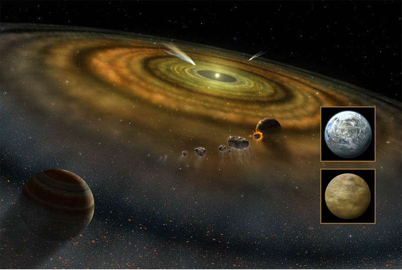

- **Planets:**
    - We believe that the planets form out of this dusty material by a process called accretion.
    - This builds up large bodies from small dust grains. Initially dust grains combine together to form kilometre-sized bodies called planetesimals.
    - These then combine to form proto-planets several hundred kilometres in size. The largest proto-planets accrete more material to become planets.
    - In the inner Solar System it is hot enough that planets can only form out of the dust that makes rocky planets.
    - In the outer Solar System, where it is colder outside what is called a "frost line", there are also ices available as a material to form planetary cores.
    - If the core of such a planet gets sufficiently massive (around ten Earth masses) it will have enough mass to pull in gas from the nebula and so form a gas giant planet. The result is the formation of giant planets in the outer parts, and the rocky planets in the inner parts, of the Solar System.
- **Planetary Satellites:**
    - The large satellite systems of giant planets probably formed from the disks of materials around the planet. That is, the giant planets formed like Solar System in miniature, each with their own accretion disk. In addition, some of the smaller satellites are probably captured asteroids or comets. This would include the Martian satellites Phobos and Deimos and probably many of the smaller satellites of outer planets.
    - **Moon:**
        - The mostly accepted theory for the formation of the Moon is that it arose from the collision of the Earth with a Mars size body very early in the Solar System's history.
        - The models of this collision have determined that you can produce an object like the Moon when a body of mass similar to Mars (which is about one 10th of the mass of the Earth) hits our planet.
        - This impact model explains a number of features of the Earth-Moon system, such as a very large angular momentum, which can be produced by the momentum carried by the impacting body. It also explains the low density of the Moon, because the Moon formed from the outer mantle parts impactor, while the core of the impacting body ended up in the core of the Earth. The model also explains the lack of volatile elements on the Moon.
    - **The Unusual Rotation of Venus or Uranus:**
        - Venus rotates slowly backwards, Uranus rotates on its side with its rotation axis inclined at about 90 degrees.
        - This could be explained by it being knocked over by a collision with another object in the early Solar System.
    - So it looks like there was a relatively violent phase in the early Solar System when there were many collisions between proto-planetary objects. The images of our own Moon and Mercury show a cratered surface that bears the scars of such violent bombardment by the small bodies left-over from the early phase of planetary formation processes.
- **Planetary Atmospheres:**
    - The giant planets have what are called "primary atmospheres" that were probably accreted from the Solar Nebula. These are made out from the original gases in the Solar Nebula (mainly hydrogen and helium), from which they also form molecules like methane and ammonia.
    - However terrestrial planets are not massive enough to hold on to this original atmosphere of hydrogen (hydrogen atoms are so low in mass that it easily escapes fro the Earth's gravitational pull).
    - So the terrestrial planets' atmospheres are thought to be secondary atmospheres. The main process that is thought to be important in the formation of such atmospheres are gasses coming from the planet itself, in a process called outgassing.
    - Volcanism puts gases including carbon dioxide, nitrogen, carbon monoxide, water vapour and sulphur oxides into the atmosphere There would not have been any oxygen in the atmospheres of the terrestrial planets initially. There is no oxygen currently in the atmosphere of Mars and Venus. Oxygen is something that was added later to the Earth's atmosphere by the action of life, through photosynthesis in cyanobacteria originally, and later in plants.
- **Archean Earth:**
    - If we look at all the objects in the Solar System that have old surfaces, we see that these surfaces are all heavily cratered. This is evidence of the final stage of the building up of planets by accretion. So for example we see craters on Mars, on the Moon and on Mercury.
    - Even on objects like Callisto and Enceladus in the outer Solar System, we see cratered surfaces, though these craters are seen in ice - it is cold enough in the outer Solar System that ices behave very much like a rock.
    - So these cratered surfaces can be regarded as the evidence of the final stage of planetary formation and the proof of the accretion theory of the formation of planets.

### 2.2 The Earth - Evolution of a habitable planet

> Formation of the Earth and Moon. Age of the Earth. The heavy bombardment. Plate tectonics. Formation of oceans and continents. Evolution of the atmosphere. The faint-young Sun paradox and its resolution.

### 2.3 Exploring the Solar System

> Getting to a planet. Types of space missions. The key planetary exploration mission and what we have learnt from them. Ground-based studies of the planets.

### 2.4 Habitability in the Solar System

> Definition of a habitable planet. Follow the Water. Past water on Venus. Evidence for water on Mars in the past and now. Evidence for oceans beneath the ice of Jupiter’s moons and Enceladus.
